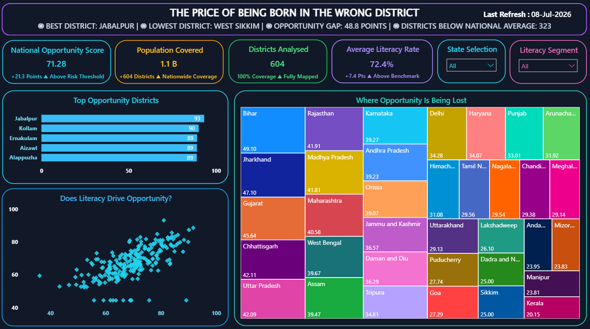
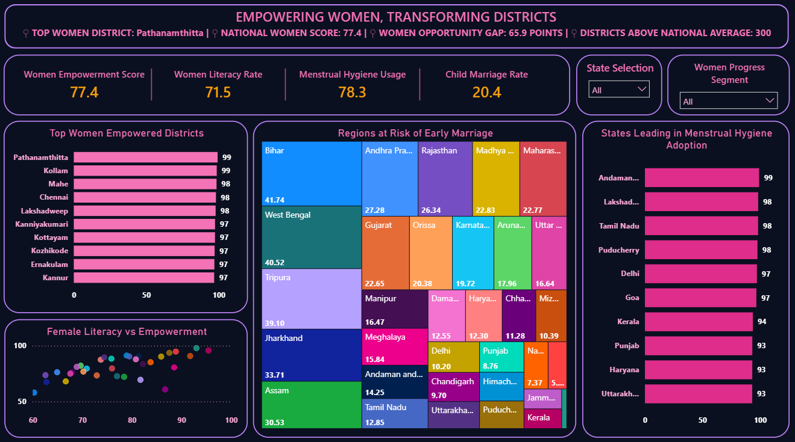
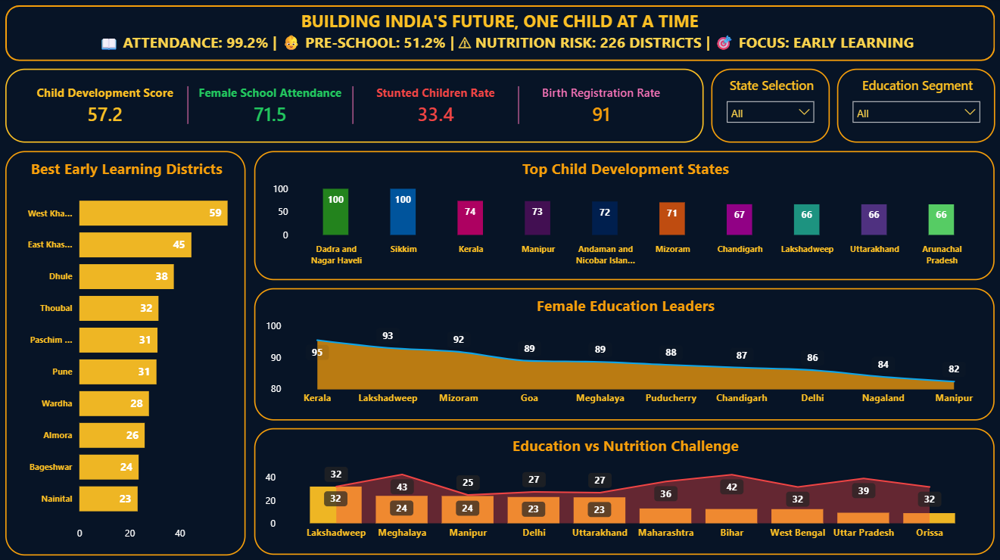
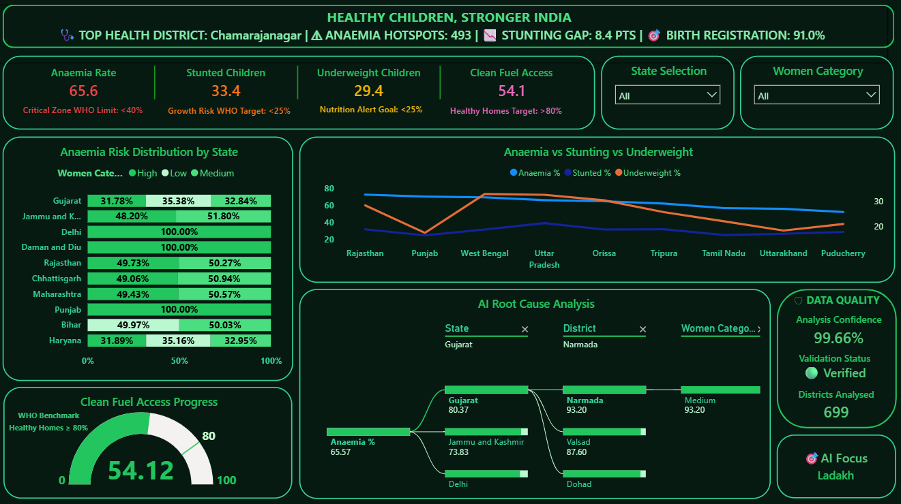
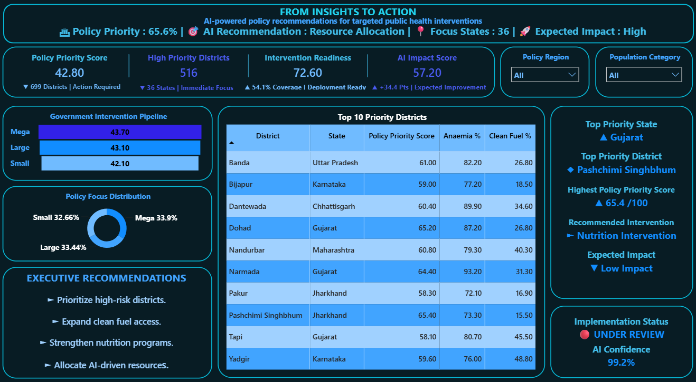
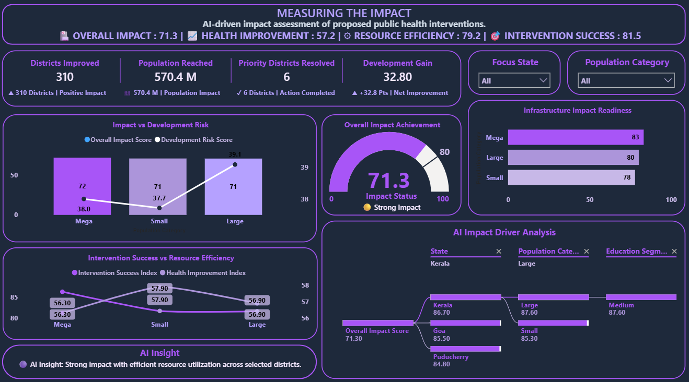
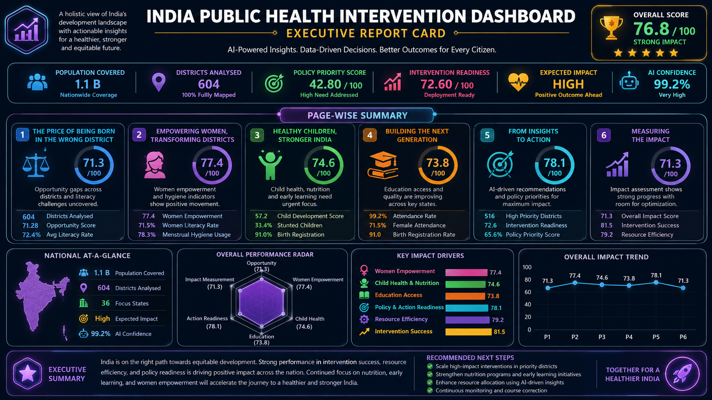

# 🩺 Healthy Children, Stronger India

### Executive Public Health Analytics Dashboard | Power BI

<p align="center">


</p>

<p align="center">

**Transforming India's Public Health Data into Decision-Ready Intelligence**

*Executive Dashboards • Interactive Analytics • KPI Frameworks • Data Storytelling*

</p>

---

# Executive Overview

**Healthy Children, Stronger India** is a **7-page Executive Public Health Analytics Dashboard** developed in **Power BI** to analyze India's health and development indicators through an executive decision-making lens.

Rather than presenting isolated charts, this project follows a structured analytical journey—from identifying regional inequalities and public health challenges to evaluating intervention readiness, measuring policy impact, and delivering executive-level recommendations.

The dashboard demonstrates how **Business Intelligence, Data Modeling, DAX, Power Query, and Interactive Reporting** can transform complex datasets into meaningful insights that support evidence-based decision-making.

---

# Why This Project?

Public health data contains valuable information, but decision-makers often struggle to convert raw numbers into actionable strategies.

Traditional reports answer **"What happened?"**

This dashboard goes further by answering:

- **Where are the highest-risk regions?**
- **Which districts require immediate intervention?**
- **What factors are driving poor outcomes?**
- **Which policies should be prioritized?**
- **How can impact be measured over time?**

The result is an executive reporting solution that bridges the gap between data analysis and strategic decision-making.

---

# Business Objectives

This project was designed to:

- Analyze India's public health and development indicators.
- Identify high-priority districts and vulnerable populations.
- Evaluate child health, women's well-being, education, and infrastructure readiness.
- Prioritize policy interventions using data-driven insights.
- Measure implementation impact through executive KPIs.
- Support evidence-based public health decision-making.

---

# Dashboard Journey

The project is structured as a connected analytical story across seven executive dashboards.

| Page | Dashboard | Business Focus |
|------|-----------|----------------|
| 1 | The Price of Being Born in the Wrong District | Regional Opportunity Analysis |
| 2 | The State of Women's Well-Being | Women's Development Analytics |
| 3 | Building the Next Generation | Child Development & Education |
| 4 | Healthy Children, Stronger India | Nutrition & Public Health |
| 5 | From Insights to Action | Policy Prioritization |
| 6 | Measuring the Impact | Intervention Performance |
| 7 | Executive Summary | Strategic Decision Report |

---

# Project Highlights

✔ 7 Executive Dashboards

✔ Interactive KPI Framework

✔ Dynamic DAX Measures

✔ Power Query Data Transformation

✔ Data Modeling

✔ Executive Reporting

✔ Business Intelligence

✔ Interactive Slicers

✔ AI-style Executive Insights

✔ Decomposition Tree Analysis

✔ Gauge Visualizations

✔ Executive Summary Dashboard

---

# Technology Stack

| Category | Technologies |
|-----------|--------------|
| Visualization | Power BI |
| Data Preparation | Power Query |
| Data Modeling | Star Schema |
| Analytics | DAX |
| Data Source | Microsoft Excel / CSV |
| Reporting | Executive Dashboard |
| Techniques | KPI Frameworks, Interactive Reporting, Data Storytelling |

---

# Key Skills Demonstrated

- Power BI Development
- Business Intelligence
- Data Visualization
- Dashboard Design
- Data Modeling
- DAX
- Power Query
- KPI Development
- Executive Reporting
- Interactive Reporting
- Analytical Storytelling
- Decision Support Analytics

---

# Dashboard Preview

The following sections showcase all seven executive dashboards developed as part of this analytics solution.
---

# Dashboard Gallery

## Page 1 — The Price of Being Born in the Wrong District

**Business Goal**

Analyze district-level opportunity disparities and identify regions where social and development indicators require immediate attention.

**Key Insights**

- Opportunity Score Distribution
- Literacy Performance
- District Ranking
- Regional Inequality Analysis
- Interactive State Filtering



---

## Page 2 — The State of Women's Well-Being

**Business Goal**

Evaluate women's education, empowerment, literacy, menstrual hygiene, and child marriage indicators to identify regions requiring targeted interventions.

**Key Insights**

- Women Empowerment Score
- Literacy Analysis
- Menstrual Hygiene Coverage
- Child Marriage Risk
- High Performing States



---

## Page 3 — Building the Next Generation

**Business Goal**

Assess early childhood development using education, attendance, nutrition, and learning indicators.

**Key Insights**

- Child Development Score
- Female School Attendance
- Nutrition Risk
- Best Performing Districts
- Education vs Nutrition Analysis



---

## Page 4 — Healthy Children, Stronger India

**Business Goal**

Measure children's health status by analyzing anaemia, stunting, underweight prevalence, clean fuel access, and healthcare readiness.

**Key Insights**

- Anaemia Distribution
- Stunting Analysis
- Underweight Children
- Clean Fuel Accessibility
- Root Cause Analysis



---

## Page 5 — From Insights to Action

**Business Goal**

Convert analytical findings into executive recommendations through intervention prioritization and policy readiness assessment.

**Key Insights**

- Priority District Ranking
- Intervention Pipeline
- Policy Readiness Score
- Executive Recommendations
- AI-inspired Decision Support



---

## Page 6 — Measuring the Impact

**Business Goal**

Evaluate intervention effectiveness using executive KPIs, impact tracking, infrastructure readiness, and performance monitoring.

**Key Insights**

- Overall Impact Score
- Infrastructure Readiness
- Intervention Success
- Resource Efficiency
- Executive Impact Dashboard



---

## Page 7 — Executive Summary

**Business Goal**

Provide a consolidated executive report that summarizes the complete analytical journey, strategic priorities, and key recommendations.

**Executive Snapshot**

- National Health Overview
- Opportunity Assessment
- Women Development
- Child Health Status
- Intervention Priorities
- Impact Measurement
- Executive Decision Summary



---

# Dashboard Capabilities

### Executive Reporting

Interactive dashboards designed for strategic decision-making.

### KPI Monitoring

Dynamic KPI framework powered by DAX measures.

### Interactive Analytics

Cross-filtering, slicers, drill-down analysis, and decomposition tree visuals.

### Data Storytelling

A structured analytical flow that transforms raw data into executive insights.

### Decision Support

Business Intelligence dashboards that support policy planning and impact evaluation.

### Public Health Intelligence

Integrated analysis of child health, women development, nutrition, education, infrastructure, and intervention effectiveness.

---
# Repository Structure

```text
healthy-children-stronger-india-powerbi-dashboard
│
├── Dashboard.pbix
├── README.md
│
├── dataset
│   ├── Dataset1.csv
│   └── Dataset2.csv
│
└── images
    ├── 01-the-price-of-being-born-in-the-wrong-district.png
    ├── 02-the-state-of-womens-well-being.png
    ├── 03-building-the-next-generation.png
    ├── 04-healthy-children-stronger-india.png
    ├── 05-from-insights-to-action.png
    ├── 06-measuring-the-impact.png
    └── 07-executive-summary.png
```

---

# Getting Started

### Clone the Repository

```bash
git clone https://github.com/rambabuanalytics/healthy-children-stronger-india-powerbi-dashboard.git
```

### Open Dashboard

Open the **Dashboard.pbix** file using **Microsoft Power BI Desktop**.

### Explore

- Navigate across all seven dashboard pages.
- Apply interactive slicers and filters.
- Explore executive KPIs and dynamic insights.
- Analyze intervention priorities and impact measurement.

---

# Dataset Information

The project uses structured public health datasets containing indicators related to:

- Child Development
- Women's Well-being
- Nutrition
- Education
- Healthcare
- Infrastructure
- Opportunity Analysis
- District Development
- Policy Readiness

The datasets are available inside the **dataset** folder.

---

# Business Value

This dashboard demonstrates how Business Intelligence can transform raw public health data into strategic decision support by:

- Identifying high-priority districts
- Highlighting regional disparities
- Monitoring intervention readiness
- Tracking implementation impact
- Supporting evidence-based policy decisions

---

# Skills Demonstrated

### Business Intelligence

- Executive Dashboard Design
- KPI Framework Development
- Interactive Reporting
- Analytical Storytelling

### Power BI

- Data Modeling
- DAX
- Power Query
- Drill-through Analysis
- Cross-filtering
- Dynamic Measures

### Analytics

- Data Cleaning
- Data Transformation
- Data Visualization
- Executive Reporting
- Decision Support Analytics

---

# Future Enhancements

- AI-assisted Predictive Analytics
- Forecasting Models
- Automated Data Refresh
- District-level Drill-through Reports
- Real-time Dashboard Integration
- Advanced Performance Monitoring

---

# About the Author

## Rambabu

Aspiring Data Analyst with a strong interest in **Business Intelligence, Power BI, Data Analytics, and Executive Dashboard Development**. Passionate about transforming complex datasets into meaningful insights that support better decision-making.

### Connect with Me

**LinkedIn**

https://www.linkedin.com/in/rambabunarvariya/

**GitHub**

https://github.com/rambabuanalytics

---

# If You Like This Project

If this project added value or inspired you, consider giving it a ⭐ on GitHub.

Your support motivates me to build more analytics and Business Intelligence projects.

---

## License

This project is intended for learning, portfolio demonstration, and educational purposes.

© Rambabu
